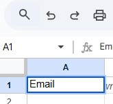

## Info of the project
- In this project, we are going to send the email data in the google sheets. 
- In order words, after submitting the email the email name will be in the google sheets

## Submitting the data in the google sheets steps
1. Open the google Sheets
2. Create the new google sheet file and rename it
3. Then write the name attribute in the input field and the same name should be given in the google sheet.

4. Click on extension of the google sheet which is at the top and then click on the apps script.
5. Copy the code from the down github url and paste it in the apps script
6. Save and run in the app script.
7. After that click on the new deployment.
8. Then click on the web app and make the anyone.
9. Atlast copy the url and paste it in the js.
10. copy the js code from the down github url

## Process tutoiral 
https://github.com/jamiewilson/form-to-google-sheets

## Result after submitting the email
https://docs.google.com/spreadsheets/d/1huvsTeyq3XlbSG-NXZdBHnoiJumTFWp3H3aRygFoCp8/edit?gid=0#gid=0